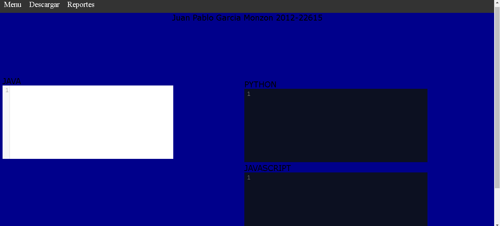
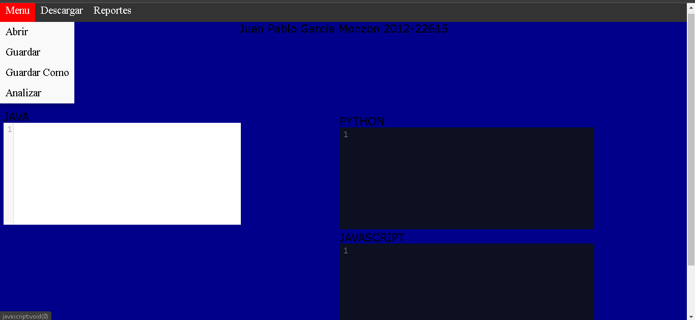
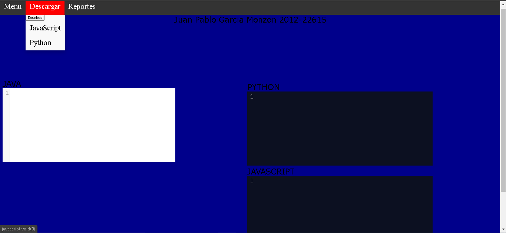
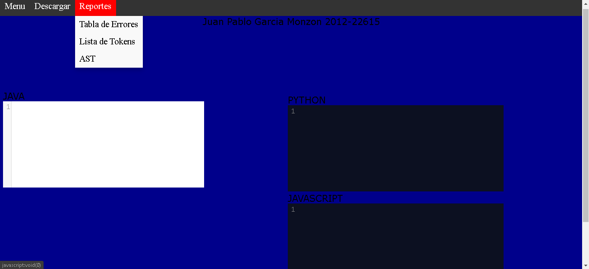

# Manual de Usuario - Proyecto 2
Juan Pablo García Monzon - 2012-22615

<b>Este proyecto necesita estos requerimientos para funcionar</b>

* Buscador (Chrome, Edge, etc)

* Windows 10, Linux, Mac

* NodeJS, Golang

* 1GB de RAM

* Cuenta en Docker Hub y Docker CLI

Flujo del proyecto
* Se descarga el contenedor necesario para correr las aplicaciones (goweb, nodeweb)

* Correr contenedores

* Al abrir la aplicacion dar click en el botón "Menú" y dar click en "Abrir" para poder buscar el archivo ".java" que se quiera analizar o escribir desde 0 un archivo java en el área de texto "JAVA" y luego dar click en el botón "Analizar" que esta en el botón "Menú".

* Dar click en "Menu" "Guardar" o "Guardar Como" para guardar el archivo ".java" 
* Dar click en el botón "Descargar" y elegir si descargar el analisis de "JavaScript", "Python" o ambos.
* Dar click en el botón "Reportes" para poder ver los reportes como "AST", "Lista de Tokens" o "Tabla de Errores"

